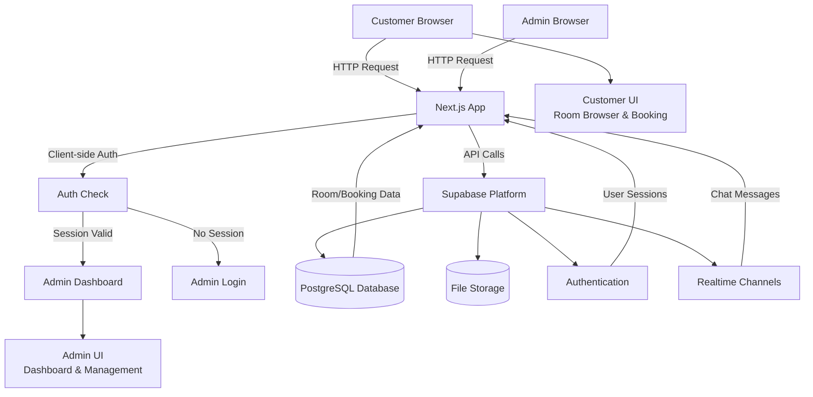

# Hotel Booking System


A modern hotel booking management system with real-time chat support, overbooking prevention, and secure administration dashboard. Built with Next.js, Supabase, and Tailwind CSS.

## Overview

The Hotel Booking System provides comprehensive reservation management with dual booking modes: Hard Booking for confirmed reservations and Real-time Soft Booking (Inquiry Chat) for customer inquiries. The system includes separate interfaces for customers and administrators with robust authentication and real-time communication capabilities.

## Key Features

- **Real-time Chat System**: Built on Supabase Realtime Channels for instant customer-administrator communication
- **Overbooking Prevention Engine**: Conflict detection and validation for overlapping reservations
- **Dynamic Room Management**: Complete CRUD operations for room inventory with pricing and availability tracking
- **Secure Admin Dashboard**: Role-based authentication with client-side session management
- **Dual Booking Modes**: Hard Booking (confirmed reservations) and Soft Booking (inquiry chat)
- **Responsive UI**: Mobile-first design with Tailwind CSS and Shadcn components


## Architecture



## Getting Started

## Tech Stack

| Technology | Purpose | Version |
|------------|---------|---------|
| **Next.js** | Full-stack React framework with App Router | 16.1 |
| **Supabase** | Backend-as-a-Service (Auth, Database, Storage, Realtime) | 3.0 |
| **PostgreSQL** | Relational database for reservations and rooms | 15+ |
| **Tailwind CSS** | Utility-first CSS framework for styling | 3.4 |
| **TypeScript** | Type-safe JavaScript development | 5.0 |
| **Shadcn/ui** | Accessible component library | Latest |
| **React** | UI library for component-based architecture | 18.2 |

### Prerequisites

- Node.js 18+ and npm/yarn/pnpm
- Supabase account and project
- PostgreSQL database (provided by Supabase)


### Installation

1. **Clone the repository**
   ```bash
   git clone <repository-url>
   cd hotel-booking-system
   ```

2. **Install dependencies**
   ```bash
   npm install
   # or
   yarn install
   # or
   pnpm install
   ```

3. **Configure environment variables**
   Create a `.env.local` file in the root directory:
   ```env
   NEXT_PUBLIC_SUPABASE_URL=your_supabase_project_url
   NEXT_PUBLIC_SUPABASE_ANON_KEY=your_supabase_anon_key
   ```

4. **Set up Supabase database**
   - Create a new Supabase project
   - Run the SQL schema from `database/schema.sql`
   - Enable Row Level Security (RLS) policies
   - Configure Supabase Realtime for the `chat_messages` table

5. **Run the development server**
   ```bash
   npm run dev
   # or
   yarn dev
   # or
   pnpm dev
   ```

6. **Access the application**
   - Customer interface: http://localhost:3000
   - Admin login: http://localhost:3000/admin/login
   - Default admin credentials (configure in Supabase Auth):
     - Email: admin@hotel.com
     - Password: admin123

### Development Scripts

- `npm run dev` - Start development server
- `npm run build` - Build for production
- `npm start` - Start production server
- `npm run lint` - Run ESLint

## Project Structure

```
hotel-booking-system/
├── src/
│   ├── app/                    # Next.js App Router pages
│   │   ├── admin/              # Admin dashboard pages
│   │   ├── rooms/              # Customer room pages
│   │   └── layout.tsx          # Root layout
│   ├── components/             # React components
│   │   ├── ui/                 # Shadcn/ui components
│   │   ├── Header.tsx          # Navigation header
│   │   ├── ChatRoom.tsx        # Customer chat component
│   │   └── AdminChatRoom.tsx   # Admin chat component
│   └── lib/                    # Utility libraries
│       ├── supabase.ts         # Supabase client
│       ├── config.ts           # Configuration
│       └── utils.ts            # Helper functions
├── database/
│   └── schema.sql              # Database schema
├── public/                     # Static assets
└── package.json                # Dependencies
```

## Database Schema

Key tables include:
- `rooms` - Room inventory with pricing and availability
- `bookings` - Reservation records with status tracking
- `chat_messages` - Real-time communication between customers and admins
- `users` - User authentication (managed by Supabase Auth)

## Authentication Flow

The system implements client-side authentication using Supabase Auth with the following flow:

1. **Admin Authentication**: Client-side session validation in `admin/layout.tsx`
2. **Session Management**: Real-time auth state monitoring with `onAuthStateChange`
3. **Protected Routes**: Automatic redirect to login for unauthenticated admin access
4. **Logout Handling**: Session cleanup and local storage clearance

## Deployment

### Vercel (Recommended)

1. Connect your GitHub repository to Vercel
2. Configure environment variables in Vercel dashboard
3. Deploy with automatic CI/CD

### Self-hosting

1. Build the application: `npm run build`
2. Start the production server: `npm start`
3. Configure reverse proxy (nginx/Apache) for HTTPS

## Contributing

1. Fork the repository
2. Create a feature branch (`git checkout -b feature/amazing-feature`)
3. Commit changes (`git commit -m 'Add amazing feature'`)
4. Push to branch (`git push origin feature/amazing-feature`)
5. Open a Pull Request

## License

Proprietary - All rights reserved.

## Support

For technical support or questions, contact the development team or create an issue in the repository.
